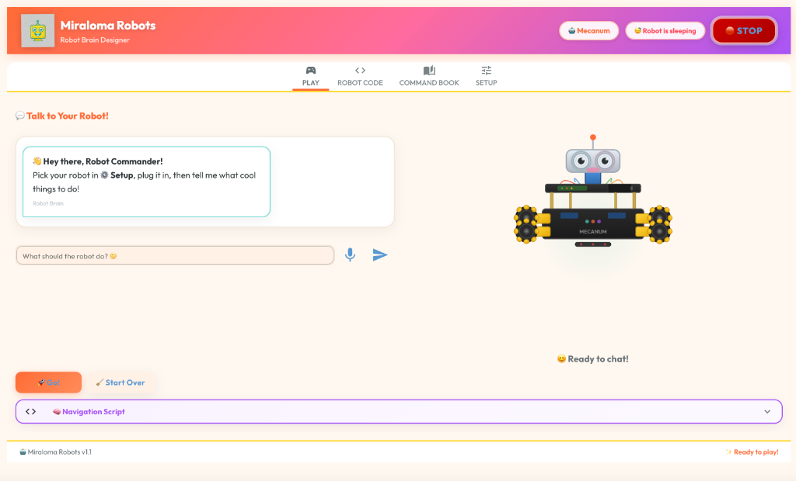

# 🤖 Miraloma Robots

> **Talk to your robot, and watch it move!**
> A voice & chat-powered robotics platform built for kids at [Miraloma Elementary School](https://miralomasf.com/).




---

## ✨ What Is This?

Miraloma Robots is an **AI-powered robot control center** that lets kids talk to their robots using plain English — by voice or text. The AI (Google Gemini) understands what they want to do, generates Python code in real-time, and sends commands to the robot over a serial (USB) connection.

**Example commands:**
- *"Move forward 3 feet"* → robot drives forward for exactly 3 feet
- *"Explore the room and avoid obstacles"* → generates a navigation loop with sensor readings
- *"Do a dance!"* → triggers a fun robot animation

---

## 🎮 Features

| Feature                   | Description                                                         |
| ------------------------- | ------------------------------------------------------------------- |
| 🗣️ **Voice Chat**          | Talk to your robot using the microphone (Web Speech API)            |
| 💬 **Text Chat**           | Type commands in natural language                                   |
| 🧠 **AI Code Gen**         | Gemini generates & classifies Python code (action vs navigation)    |
| 🚀 **Auto-Execute**        | Simple commands run immediately; complex navigation waits for "Go!" |
| 🤖 **Multi-Robot**         | Switch between different robots (Mecanum car, Spider walker)        |
| 📟 **Firmware View**       | View and copy firmware source code for flashing                     |
| 📖 **Command Book**        | Auto-generated protocol reference from YAML definitions             |
| 🛑 **Emergency Stop**      | One-click stop button halts all motors instantly                    |
| 🎨 **Animated Robot Face** | SVG robot face that reacts to listening/thinking states             |
| ⚙️ **Calibration**         | Tune speed-per-foot and motor defaults per robot                    |

---

## 🏗️ Architecture

```
┌──────────────────────────────────────────────────┐
│               Browser (NiceGUI)                  │
│  ┌──────────┐ ┌──────────┐ ┌─────────────────┐  │
│  │ Voice/   │ │ Animated │ │  Navigation     │  │
│  │ Text     │ │ Robot    │ │  Script Viewer  │  │
│  │ Chat     │ │ Face     │ │  + Go!/Stop     │  │
│  └────┬─────┘ └──────────┘ └────────┬────────┘  │
│       │                             │            │
├───────┴─────────────────────────────┴────────────┤
│               Python Backend                     │
│  ┌────────────┐ ┌────────────┐ ┌──────────────┐  │
│  │ Gemini     │ │ Navigation │ │ Robot HAL    │  │
│  │ Client     │ │ Runtime    │ │ (pyserial)   │  │
│  └──────┬─────┘ └─────┬──────┘ └──────┬───────┘  │
│         │             │               │          │
│    AI Response    exec(code)    UART commands    │
├───────────────────────────────────────┬──────────┤
│                                       │          │
│                              USB Serial          │
│                                       │          │
│                    ┌──────────────────┴───┐      │
│                    │  Micro:bit / ESP8266 │      │
│                    │  (Firmware Bridge)   │      │
│                    └──────────────────────┘      │
└──────────────────────────────────────────────────┘
```

---

## 🚀 Getting Started

### Prerequisites

- **Python 3.10+**
- A **Google Gemini API key** — get one free at [Google AI Studio](https://aistudio.google.com/apikey)
- A supported robot with USB serial connection (Micro:bit or ESP8266-based)

### Installation

```bash
# Clone the repo
git clone https://github.com/spedemon/miraloma_bots.git
cd miraloma_bots

# Install Python dependencies
pip install -r requirements.txt

# Run the app
python main.py

# Optional: Run on a different port (default: 8080)
python main.py --port 8888

# Optional: Run in native window mode
python main.py --native
```

The app opens at **http://localhost:8080** (or your specified port).

### First-Time Setup

1. Go to the **⚙️ Setup** tab
2. **Pick your robot** (Mecanum or Spider)
3. **Connect** — select the USB port and click "Plug In!"
4. **Add your API key** — paste your Gemini API key and click "Save & Test"
5. Switch to the **🎮 Play** tab and start talking to your robot!

---

## 📂 Project Structure

```
├── main.py                  # NiceGUI app — UI, handlers, launch
├── gemini_client.py         # Google Gemini API wrapper & response parser
├── robot_hal.py             # Hardware Abstraction Layer (serial/UART)
├── nav_runtime.py           # Runtime API for LLM-generated scripts
├── requirements.txt         # Python dependencies
├── static/
│   └── logo.png             # App logo
├── robots_firmware/
│   ├── mecanum/             # Mecanum car robot
│   │   ├── main.ts          # MakeCode firmware (Static TypeScript)
│   │   ├── protocol.yaml    # UART command definitions
│   │   └── robot_architecture.md   # Robot identity & capabilities
│   └── spider/              # Spider walker robot
│       ├── main.c           # ACECode/Arduino firmware
│       ├── protocol.yaml    # UART command definitions
│       └── robot_architecture.md   # Robot identity & capabilities
├── MASTER_PLAN.md           # Original technical specification
└── ROADMAP.md               # Project roadmap & progress
```

---

## 🤖 Supported Robots

Miraloma Robots currently supports two very different robot platforms. Despite their
hardware differences, both share a **unified architecture**: custom firmware implements
a **UART protocol** that gives direct access to actuators, sensors, and I/O over a USB
serial connection. The Python **Navigation Runtime** then wraps that UART interface in
an object-oriented `Robot` class whose documentation is fed to the Gemini AI agent, so
it can generate control code with full access to each robot's capabilities.

### Mecanum Car

| | |
|---|---|
| **MCU** | [BBC Micro:bit V2](https://microbit.org/) — ARM-based Nordic Semiconductor nRF52833 |
| **Chassis** | Keyestudio Mecanum 4WD — omnidirectional wheels |
| **Sensors** | Ultrasonic distance (servo-mounted), 3-channel line tracker |
| **IDE** | [Microsoft MakeCode for Micro:bit](https://makecode.microbit.org/) (web-based) |

The Micro:bit V2 is a board created by **BBC** in collaboration with **ARM** and
**Microsoft**. It is typically programmed using **MakeCode Micro:bit**, a web-based tool
that offers a beautiful **block programming** interface for kids (similar to Scratch).
MakeCode maintains a one-to-one mapping between the visual blocks and
**Static TypeScript (STS)** code. The STS is then compiled to **ARM Thumb machine code**
directly within the browser using a dedicated compiler implemented in TypeScript itself.
MakeCode uses **WebUSB** to flash the device and communicate via serial port — no
drivers or native tools needed.

**Firmware:** Miraloma Robots provides a custom STS script (`main.ts`) that implements
a UART protocol exposing direct access to all actuators and sensors. To flash:

1. Open the **Robot Code** tab in Miraloma Robots and copy the firmware source
2. Paste it into [MakeCode](https://makecode.microbit.org/) (switch to JavaScript/TypeScript view)
3. Click **Download** — MakeCode flashes the Micro:bit via WebUSB

**Control interface:** The UART protocol (documented in the **Command Book** tab)
exposes both **low-level** methods (control individual wheel speeds) and **high-level**
methods (move forward, backward, rotate, strafe sideways — made possible by the
mecanum wheels). The AI agent chooses freely between low- and high-level commands
depending on the user's request, and generally picks the right abstraction level.

---

### Spider Walker

| | |
|---|---|
| **MCU** | ESP8266 (Wi-Fi SoC) |
| **Chassis** | ACEBott Spider — multi-servo hexapod-style walker |
| **Library** | `ACB_Spider_ESP8266` (provided by ACEBott) |
| **IDE** | [ACECode](https://www.acebott.com/) (desktop app for macOS / Windows) |

The Spider is a very different beast (insect, really). It uses an **ESP8266** and is
programmed via **ACECode**, a desktop application that provides a **block programming**
graphical language nearly identical to MakeCode. ACECode generates **C / Arduino** code
and compiles and flashes it to the device. ACECode also has a panel that allows pasting
raw C code directly.

**Firmware:** Miraloma Robots provides a custom C firmware (`main.c`) that wraps the
**ACB_Spider_ESP8266** library, exposing motion primitives and preset actions over UART.
To flash:

1. Open the **Robot Code** tab in Miraloma Robots and copy the firmware source
2. Open ACECode, paste the C code in the code panel
3. Click **Upload** to compile and flash the ESP8266

> **Why ACECode?** Other Arduino IDEs can be used, but ACECode automatically configures
> the Arduino library paths for the Spider robot (provided by ACEBott). This avoids
> manual library setup.

**Control interface:** The Spider has many servos and motion requires complex
coordination. The `ACB_Spider_ESP8266` library provides high-level motion primitives
that the firmware exposes over UART: move forward, backward, sideways, rotate left /
right. It also exposes preset **actions**: standby, lying, sleep, greet, pushup,
fighting, dancing, swing, and handsome.

---

### Unified Robot API

Both robots implement the same UART protocol structure (setters for actuators, getters
for sensors). The Python `Robot` class in `nav_runtime.py` wraps these UART commands
into a unified object-oriented API, so AI-generated code like `robot.move_forward(150)`
works identically on both platforms.

Many commands are **shared** between robots (high-level motion primitives), while others
are **unique** (e.g., Spider's preset animations, Mecanum's individual wheel control and
ultrasonic sensor). The UART protocol and the `Robot` wrapper are intentionally designed
to **unify commands across robots** where possible.

> **Note:** The Miraloma Robots UI currently does not show documentation of the Python
> `Robot` class to the user. However, the AI agent has full access to this documentation
> in its system prompt, enabling it to generate correct control code for whichever robot
> is selected.

---

## 🧠 How the AI Works

1. You type or say a command (e.g., *"move forward 2 feet"*)
2. **Gemini** receives the command along with a system prompt that includes the robot's full command reference and architecture
3. The AI classifies the intent:
   - **`[ACTION]`** — simple command → generates Python code and **runs it immediately**
   - **`[NAVIGATION]`** — complex navigation → generates code and **waits for you to press Go!**
   - **Conversation** — no code, just a friendly chat reply
4. Generated code uses the `nav_runtime` API: `send()`, `read()`, `stop()`, `wait()`, `is_running()`
5. Code executes in a background thread; the **🛑 STOP** button (or voice "stop") kills it instantly

---

## 📡 Autonomous Navigation: Distance-to-Target System

This system provides high-precision distance measurement between two active nodes (the **Initiator** robot and the **Target** beacon) using a "Sync-and-Calculate" method. By using **ESP-NOW** (a low-latency radio protocol) as a "starting pistol" and the **HY-SRF05** for the "sound flight," you can achieve centimeter-level accuracy for under $15.

### System Architecture

The system relies on the speed difference between radio waves (instant) and sound (~343 m/s).

1.  **Node A (Initiator)** sends an **ESP-NOW radio packet** and simultaneously triggers its ultrasonic pulse.
2.  **Node B (Responder)** receives the radio packet, starts a microsecond timer, and waits for the ultrasonic pulse to arrive at its receiver.
3.  **Node B** calculates the distance and sends the value back to **Node A** via radio.

---

### Hardware Bill of Materials

To keep this under $15, you should use the following specific modules.

* **Primary Sensor:** HY-SRF05 Ultrasonic Module (2 per system).
* **Controller:** ESP32 or ESP8266 NodeMCU (2 per system).
* **Radio:** Integrated **ESP-NOW** (no extra hardware cost).

---

### Technical Specifications

| Feature | Specification |
| :--- | :--- |
| **Maximum Distance** | **4.5 - 5.0 Meters** (Limited by sound attenuation) |
| **Minimum Distance** | **2.0 Centimeters** |
| **Expected Resolution** | **3 mm** (Dependent on clock timing) |
| **Update Rate** | **10Hz - 20Hz** (Configurable via UART) |
| **Communication** | **ESP-NOW** (2.4GHz Peer-to-Peer) |

---

### Firmware Logic & Specifications

#### 1. The Initiator (Node A)

* **Idle State:** Listens for UART commands.
* **Trigger Sequence:**
    1.  Pulses the `Trig` pin on the HY-SRF05 for **10µs**.
    2.  Simultaneously broadcasts an **ESP-NOW sync packet** containing a unique ID and a timestamp.
* **Wait State:** Waits for an incoming ESP-NOW packet from Node B containing the calculated distance.
* **Output:** Sends the distance value to its **UART TX** line.

#### 2. The Responder (Node B)

* **Sync State:** Listens for the ESP-NOW sync packet.
* **Timing Sequence:**
    1.  Upon receiving the packet, it records the current time using `esp_timer_get_time()` (the **Start Time**).
    2.  It enables a **Hardware Interrupt** on its HY-SRF05 `Echo` pin.
    3.  When the pin goes HIGH (pulse arrival), it records the **End Time**.
* **Calculation:** Uses the formula: *Distance = (EndTime − StartTime) × 0.0343 cm/µs*.
* **Reporting:** Sends the result back to Node A via ESP-NOW and also outputs it to its own **UART TX**.

---

### UART Interface Specification

Both nodes operate at **115200 Baud**.

* **Commands (Input):**
    * `EN`: Enable active measurement (Initiator mode).
    * `DIS`: Disable measurement / Low power mode.
    * `GET`: Request the last recorded reciprocal distance.
* **Output Format:**
    * `DIST: [Value] cm` (e.g., `DIST: 124.5 cm`)
    * `STATUS: ENABLED / DISABLED`

---

### ⚡ Implementation Tip

Since the ESP32 logic levels are **3.3V** and the HY-SRF05 runs at **5V**, you must use a **Voltage Divider** (two resistors) on the sensor's `Echo` pin before connecting it to the ESP32 to prevent damage.

---

## 🤝 Contributing

We welcome contributions from parents, teachers, and fellow robotics enthusiasts!

### Adding a New Robot

1. Create a folder under `robots_firmware/<robot_name>/`
2. Add three files:
   - **`protocol.yaml`** — defines all UART commands (setters + getters). Use `mecanum/protocol.yaml` as a template.
   - **`robot_architecture.md`** — describes the robot's identity, capabilities, and limitations (this is fed to the AI as context).
   - **Firmware source** (`.ts`, `.c`, `.py`, etc.) — the code users flash onto the microcontroller.
3. The robot will auto-appear in the **Setup** tab dropdown!

### Development Workflow

```bash
# Fork the repo & clone your fork
git clone https://github.com/<your-username>/miraloma_bots.git
cd miraloma_bots

# Install dependencies
pip install -r requirements.txt

# Run the app (hot-reload is on by default unless using --native)
python main.py

# To run in a native app window:
python main.py --native
```

### Areas Where Help Is Needed

- **Testing** — End-to-end testing with actual robots, unit tests
- **New robots** — Add support for more robot platforms
- **UI improvements** — Responsive layout, mobile support
- **Firmware** — Improve or add safety features to robot firmware
- **Translations** — Make the UI accessible to non-English speakers

---

## 📜 License

This project is open source and available under the [MIT License](LICENSE).

---

## 🙏 Acknowledgments

Built with ❤️ by the Miraloma Elementary School robotics community.

- [NiceGUI](https://nicegui.io/) — Beautiful Python-based web UI framework
- [Google Gemini](https://ai.google.dev/) — AI powering the robot's brain
- [Keyestudio](https://www.keyestudio.com/) — Mecanum robot hardware
- [MakeCode](https://makecode.microbit.org/) — Micro:bit programming environment
