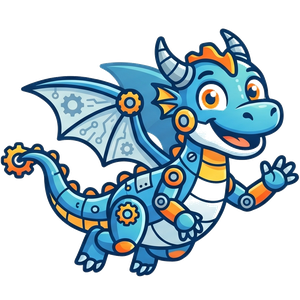
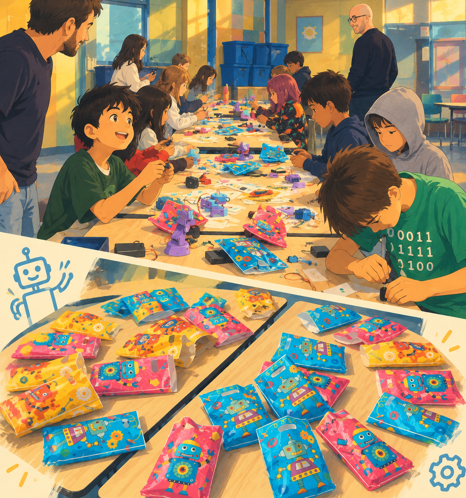

<div align="center">
  
</div>

# 🤖 Miraloma Robotics

> Open-source robots built by Miraloma students, families, and teachers.

<div align="center">



*Miraloma students, families, and teachers building robots together.*

</div>

## Do you have a Mira robot arm?

Start with the **[Mira family guide](robot_arms/README.md)**. It explains, in plain language:

- how to use the robot without a computer;
- how to download and open the Mira application;
- how to connect by Bluetooth, a direct USB cable, or the USB wireless controller;
- how to move, program, save, load, loop, and upload sequences;
- how to calibrate a hand-built arm; and
- what to do when a joint was assembled in the wrong position.

### Get the Mira app

| Platform | Get Mira | Connection support |
|---|---|---|
| macOS | [](https://github.com/spedemon/miraloma_robotics/releases/latest/download/Mira-0.2.1-macOS-arm64.dmg) | Bluetooth, direct USB, or wireless controller |
| Windows | [](https://github.com/spedemon/miraloma_robotics/releases/latest/download/Mira-Setup-0.2.1.exe) | Bluetooth, direct USB, or wireless controller |
| Android | [](https://github.com/spedemon/miraloma_robotics/releases/latest/download/Mira-0.2.1-Android.apk) | Bluetooth |
| iPhone and iPad | [](robot_arms/README.md#iphone-and-ipad) | Bluetooth; release requires an Apple Developer account |

The buttons download the installers directly. The iPhone/iPad app is ready for Apple signing and distribution, but there is no public `.ipa` download until the project has an Apple Developer account. See the **[Mira family guide](robot_arms/README.md)** for installation steps or jump to **[troubleshooting](robot_arms/README.md#troubleshooting)**.

## Projects

| Project | Best starting point | What it is |
|---|---|---|
| 🦾 **Mira robot arms** | [Family guide](robot_arms/README.md) | Build and control one arm—or a wireless group of arms—with sliders, dances, and an animation maker. |
| 🚗 **Wheeled bots** | [Wheeled-bot guide](wheeled_bots/README.md) | Voice- and text-controlled driving and walking robots powered by generated Python commands. |

## For contributors

The family-facing instructions come first in each project guide. Technical setup, firmware details, build commands, and contribution entry points are grouped near the end of those guides:

- [Mira contributor and builder documentation](robot_arms/README.md#for-contributors-and-builders)
- [Wheeled-bot documentation](wheeled_bots/README.md)
- [Mira 3D-printing files](robot_arms/3d_models/README.md)

Repository layout:

```text
miraloma_robotics/
├── robot_arms/      # Mira hardware, firmware, mobile/desktop apps, and documentation
├── wheeled_bots/    # Wheeled/walking robots, UI, and firmware
└── media/           # Project images and video
```

To contribute, fork the repository, create a focused branch, test with real hardware when possible, and open a pull request that explains the change and how it was tested.

## Thanks

Built with ❤️ by the Miraloma robotics community—students, parents, and teachers bringing robots to life together.
