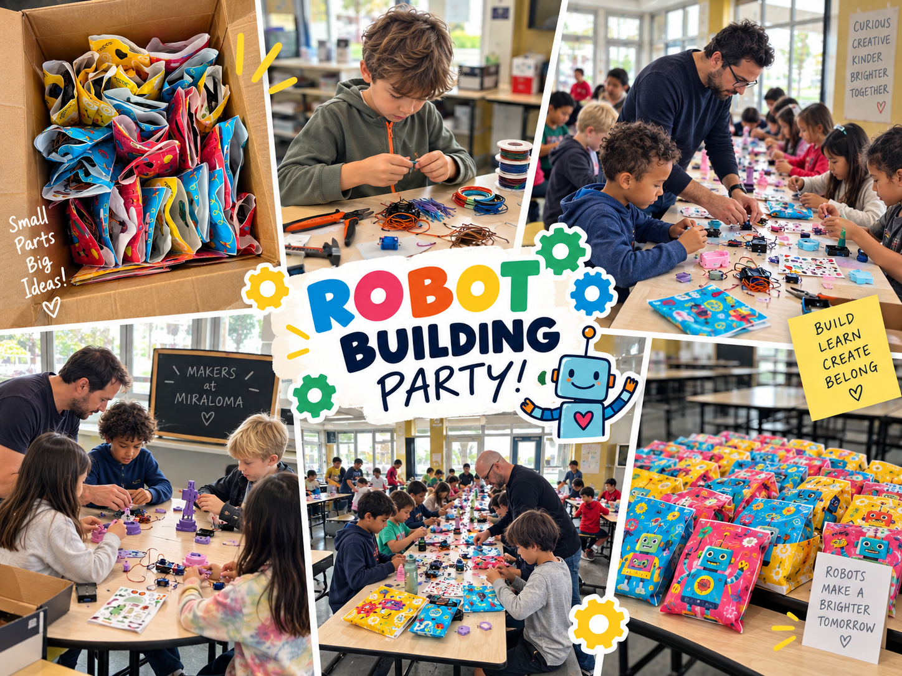

<div align="center">
  
</div>

# 🤖 Miraloma Robotics

> Open-source robots built by Miraloma students, families, and teachers.

<div align="center">



*Twenty-five Miraloma children built their own robots in a four-hour group session with four supervising adults.*

</div>

[](#build-your-own-mira)

## Mira at a glance

| | |
|---|---|
| **Approximate cost** | **$15 per robot**; parts can be sourced from Amazon or AliExpress |
| **3D-printing time** | About **3 hours per robot** on a home 3D printer |
| **Recommended age** | **Ages 5+ with adult supervision** |
| **Workshop tested** | Five-year-olds have successfully completed a robot in a three-hour supervised group session. At a four-hour party, four adults helped 25 children, and every child completed a robot. |
| **Open source** | Fully open source: the software, firmware, documentation, and 3D-printing files are available in this repository under the [MIT License](LICENSE). |

## Build your own Mira

Mira v2 is the quickest version to build. It uses five small servos, 11 screws, and no nuts.

### Parts

- 5 × SG90 micro servos
- 1 × ESP32-C3 Mini development board
- 1 × PCA9685 servo driver board
- 11 × M1.6 × 10 mm screws
- Small-diameter electrical wire
- A suitable 5–6 V power source for the servos

### Tools

- Mini screwdrivers
- Electronics flush cutter or small wire cutter
- Soldering iron, used by an adult to solder four wires from the ESP32-C3 Mini to the PCA9685: SDA, SCL, VCC, and GND

### Quick build

1. Download the [Mira v2 3D-print project](robot_arms/3D_models/3D_print_files/mira_sg90_arm_v2_bambulab_A1_mini_1x_with_stand.3mf), or use the individual [v2 STL files](robot_arms/3D_models/stl_files/stl_v2/).
2. Print the parts on a home 3D printer. A complete set takes approximately three hours, depending on the printer and settings. See the [3D-printing guide](robot_arms/3D_models/README.md) for recommended material and print settings.
3. Fit the five SG90 servos into the printed parts and assemble the arm with the M1.6 × 10 mm screws.
4. With adult supervision, prepare four short wires and solder the ESP32-C3 Mini to the PCA9685: SDA to SDA, SCL to SCL, VCC to VCC, and GND to GND. Do not power the servos from the ESP32-C3; use a suitable 5–6 V servo power source.
5. Connect the servos to the PCA9685, install the [Mira application](#get-the-mira-app), and let Mira program the ESP32-C3 as a robot controller.
6. Follow the [family guide](robot_arms/README.md) to connect, calibrate, and teach your robot its first routine.

## Do you have a Mira robot arm?

Start with the **[Mira family guide](robot_arms/README.md)**. It explains, in plain language:

- how to use the robot without a computer;
- how to download and open the Mira application;
- how to connect by Bluetooth, a direct USB cable, or the USB wireless controller;
- how to move, program, save, load, loop, and upload sequences;
- how to calibrate a hand-built arm; and
- what to do when a joint was assembled in the wrong position.

### Get the Mira app

| Platform | Get Mira | Connection support |
|---|---|---|
| macOS | [](https://github.com/spedemon/miraloma_robotics/releases/latest/download/Mira-0.3.1-macOS-arm64.dmg) | Bluetooth, direct USB, or wireless controller |
| Windows | [](https://github.com/spedemon/miraloma_robotics/releases/latest/download/Mira-Setup-0.3.1.exe) | Bluetooth, direct USB, or wireless controller |
| Android | [](https://github.com/spedemon/miraloma_robotics/releases/latest/download/Mira-0.3.1-Android.apk) | Bluetooth |
| iPhone and iPad | [](robot_arms/README.md#iphone-and-ipad) | Bluetooth; release requires an Apple Developer account |

The buttons download the installers directly. The iPhone/iPad app is ready for Apple signing and distribution, but there is no public `.ipa` download until the project has an Apple Developer account. See the **[Mira family guide](robot_arms/README.md)** for installation steps or jump to **[troubleshooting](robot_arms/README.md#troubleshooting)**.

## Projects

| Project | Best starting point | What it is |
|---|---|---|
| 🦾 **Mira robot arms** | [Family guide](robot_arms/README.md) | Build and control one arm—or a wireless group of arms—with sliders, dances, and an animation maker. |
| 🚗 **Wheeled bots** | [Wheeled-bot guide](wheeled_bots/README.md) | Voice- and text-controlled driving and walking robots powered by generated Python commands. |

## For contributors

The family-facing instructions come first in each project guide. Technical setup, firmware details, build commands, and contribution entry points are grouped near the end of those guides:

- [Mira contributor and builder documentation](robot_arms/README.md#for-contributors-and-builders)
- [Wheeled-bot documentation](wheeled_bots/README.md)
- [Mira 3D-printing files](robot_arms/3d_models/README.md)

Repository layout:

```text
miraloma_robotics/
├── robot_arms/      # Mira hardware, firmware, mobile/desktop apps, and documentation
├── wheeled_bots/    # Wheeled/walking robots, UI, and firmware
└── media/           # Project images and video
```

To contribute, fork the repository, create a focused branch, test with real hardware when possible, and open a pull request that explains the change and how it was tested.

## Thanks

Built with ❤️ by the Miraloma robotics community—students, parents, and teachers bringing robots to life together.
