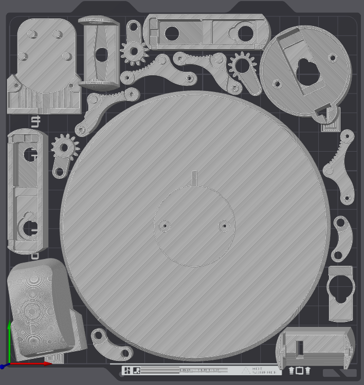

# Mira SG90 Robot Arms — 3D Models

3D-printable parts and CAD files for both versions of the Mira robot arm, designed around SG90 micro servos.

## The Two Versions

### v1 — the Miraloma classroom build

Mira v1 is the **4-degree-of-freedom** robot arm built by the kids at Miraloma on **September 27, 2026**. It uses **25 screws and 8 small nuts**, so assembly is detailed and relatively complex.

The v1 files are preserved both as the record of that classroom build and for anyone who wants to reproduce the original arm.

### v2 — faster and more modular

Mira v2 has **5 degrees of freedom**, but needs only **11 screws and no nuts**. With fewer fasteners and no tiny nuts to position, it is much faster and simpler to assemble.

v2 is designed to work in two configurations:

1. As a standalone desktop robot arm, mounted on its desktop stand.
2. As one arm of a future humanoid robot.

Its compact cylindrical base attaches with just **two screws**, so the same arm can be moved between the desktop stand and a humanoid body. The humanoid robot does not exist yet; the mounting design prepares v2 for that future use.

## Version Comparison

| | **v1** | **v2** |
|---|---:|---:|
| Degrees of freedom | 4 | 5 |
| Screws | 25 | 11 |
| Small nuts | 8 | 0 |
| Assembly | Detailed, more complex build | Faster, simpler build |
| Base | Dedicated robot-arm base | Compact cylindrical, modular base |
| Mounting | Standalone arm | 2-screw attachment to a desktop stand or future humanoid robot |

## Files

| File / folder | Version | Description |
|---|---|---|
| `sg90_robot_v1.3dm` | v1 | Editable Rhino model of the original classroom-built arm |
| `sg90_robot_v1.step` | v1 | Full assembly for editing in Fusion 360, FreeCAD, and other STEP-compatible CAD tools |
| `sg90_robot_v2.3dm` | v2 | Editable Rhino model of the modular 5-DOF arm |
| `stl_files/stl_v1/` | v1 | Individual printable parts for the original arm |
| `stl_files/stl_v2/` | v2 | Individual printable parts for the modular arm and desktop stand |
| `3D_print_files/mira_sg90_arm_bambulab_A1_mini_2x.3mf` | v1 | Bambu Studio project containing two v1 arms |
| `3D_print_files/mira_sg90_arm_v2_bambulab_A1_mini_1x_with_stand.3mf` | v2 | Bambu Studio project containing one v2 arm and its desktop stand |

## Choosing a Version

- Choose **v1** to reproduce the robot arm built by the Miraloma students on September 27, 2026.
- Choose **v2** for a faster build, an additional degree of freedom, or a modular arm that can later be attached to a humanoid robot.

## v2 Bambu Lab A1 Mini Print Plate

The prepared [v2 Bambu Studio project](3D_print_files/mira_sg90_arm_v2_bambulab_A1_mini_1x_with_stand.3mf) fits all the parts for one complete Mira v2 arm—including the tabletop stand—on a single Bambu Lab A1 Mini print plate.

## Printing Tips

- Recommended material: **PLA** or **PETG**
- Layer height: **0.2 mm** for structural parts and **0.12 mm** for gears
- Infill: **20–30%** for most parts and **50% or more** for gears and load-bearing parts
- Use the supplied `.3mf` project for the quickest path to a configured Bambu Lab A1 Mini print
