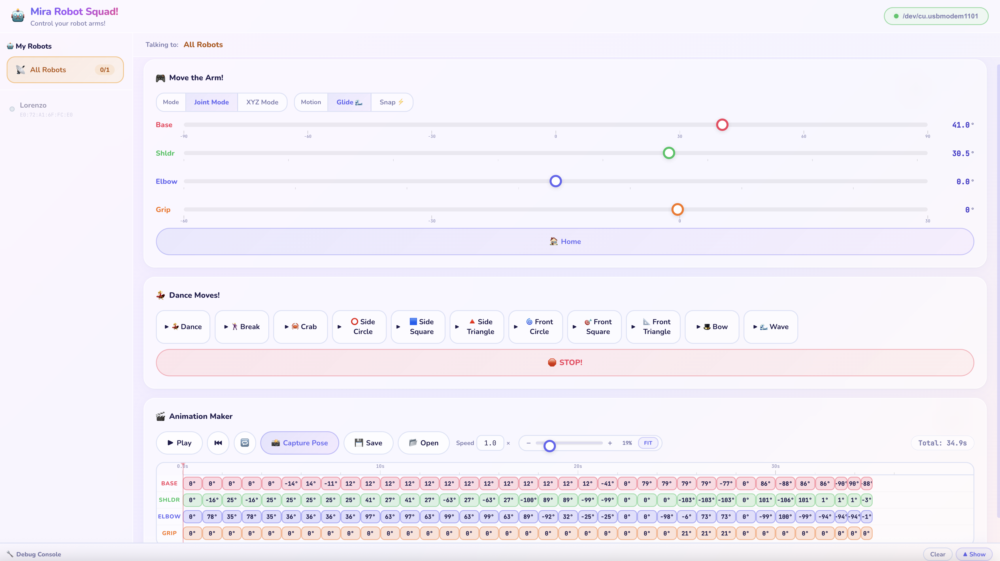

# 🦾 Robot Arms

> Part of [Miraloma Robotics](../README.md)

> **Mira** — an educational robot arm platform for elementary school kids. Control one arm or a whole swarm from a sleek web interface.

[](https://platformio.org)
[](https://python.org)



---

## ✨ What Is This?

Mira is a **3-DOF robot arm** with 4 servos (base, shoulder, elbow, grip) driven by a **PCA9685** PWM driver on an **ESP32-C3 Super Mini**. Multiple arms communicate wirelessly via **ESP-NOW** (peer-to-peer radio, no Wi-Fi router needed), forming a swarm coordinated through a USB bridge.

A web interface provides real-time control with joint sliders, Cartesian (IK) positioning, a keyframe sequencer, and built-in gesture triggers — perfect for classroom demos and choreographed performances.

---

## 📂 Project Structure

```
robot_arms/
├── 3d_models/       # CAD files, STLs, and slicer projects for 3D printing
├── robotarm_mcu/    # Firmware for each robot arm (ESP32-C3 Super Mini)
├── master_mcu/      # Firmware for the USB bridge / swarm coordinator (ESP32-C3)
└── web_app/         # Web UI + Python server (Flask + SocketIO)
    ├── mira.py          # Backend server
    ├── static/          # Frontend (HTML, CSS, JS)
    └── robot_names.json # Persistent robot display names
```

---

## 🚀 Quick Start

### Prerequisites

- [PlatformIO CLI](https://platformio.org/install/cli) — for building & flashing firmware
- Python 3.10+ — for the web server
- Two ESP32-C3 boards connected via USB

### 1. Flash the Robot Arm

```bash
cd robot_arms/robotarm_mcu
./build.sh
./flash.sh /dev/tty.usbmodemXXXX   # or let it auto-detect
```

### 2. Flash the Master (Swarm Coordinator)

```bash
cd robot_arms/master_mcu
./build.sh
./flash.sh /dev/tty.usbmodemYYYY
```

### 3. Start the Web UI

```bash
cd robot_arms/web_app
pip install -r requirements.txt
python3 mira.py
```

Open **http://localhost:5000** in your browser. Click the serial badge in the header to connect to the master's USB port. Any powered-on robot arms will appear in the swarm panel within a few seconds.

---

## 🖨️ 3D Printing

All 3D models and print files live in [`3d_models/`](3d_models/):

- **STEP file** — full assembly for CAD editing (`sg90_robot.step`)
- **STL files** — individual parts ready for any slicer (`stl/`)
- **Print files** — pre-configured Bambu Studio project (`print_files/mira_arm_2x_bambulam_mini.3mf`)

See the [3D Models README](3d_models/README.md) for full details, part lists, and printing tips.

---

## 🔧 Hardware Overview

Mira is a 3-DOF robot arm with 4 servos:

| Servo      | Axis       | Function                  |
|------------|------------|---------------------------|
| **Base**   | Vertical   | Rotates arm left / right  |
| **Shoulder** | Horizontal | Lower arm joint (up/down) |
| **Elbow**  | Horizontal | Upper arm joint (up/down) |
| **Grip**   | —          | Opens / closes gripper    |

Servos are driven by a **PCA9685** 16-channel PWM driver, connected to the ESP32-C3 via I2C. The master and robot arm nodes communicate wirelessly over **ESP-NOW** (peer-to-peer radio, no Wi-Fi router needed).

---

## 🏗️ Architecture

```
┌─────────────┐   USB Serial   ┌─────────────┐   ESP-NOW   ┌──────────────┐
│   Browser   │ ◄────────────► │   Master    │ ◄─────────► │  Robot Arm 1 │
│  (Web UI)   │   WebSocket    │   MCU       │             ├──────────────┤
│             │ ◄────────────► │             │ ◄─────────► │  Robot Arm 2 │
│             │                │             │             ├──────────────┤
│             │   Flask +      │  ESP32-C3   │   Broadcast │  Robot Arm N │
│             │   SocketIO     │             │             └──────────────┘
└─────────────┘                └─────────────┘
     mira.py                    master_mcu/                 robotarm_mcu/
```

- **Robot Arm MCU** — drives servos, runs motion planner & gestures, broadcasts heartbeat
- **Master MCU** — USB ↔ ESP-NOW bridge, tracks which arms are online, routes commands
- **Web Server** (`mira.py`) — bridges browser ↔ master serial, manages persistent state
- **Web UI** — real-time swarm panel, joint/Cartesian sliders, sequencer, gesture triggers

---

## 📡 ESP-NOW Swarm — How It Works

The swarm uses **ESP-NOW**, Espressif's peer-to-peer radio protocol. ESP-NOW works at the Wi-Fi PHY layer but **does not require a Wi-Fi router or network connection** — robots communicate directly over the air on a shared Wi-Fi channel (channel 1 by default). This makes the system completely self-contained: power on the robots and they find each other automatically.

### One Firmware, Many Robots

A key design principle is that **every robot arm runs the exact same firmware** (`robotarm_mcu`). There is no per-robot configuration — no robot IDs, no assigned addresses, no DIP switches. Each ESP32-C3 has a unique **factory MAC address** burned in at manufacture, and the swarm protocol uses these MAC addresses to identify and target individual robots.

This means deploying the swarm is as simple as:
1. **Build the firmware once** (`pio run`)
2. **Flash every robot arm with the same binary** (`./flash.sh`)
3. **Power them on** — each one automatically joins the swarm

### Auto-Discovery

When a robot arm boots, it immediately begins broadcasting **HELLO** messages every 2 seconds via ESP-NOW. Each HELLO contains the sender's factory MAC address. The master MCU listens for these HELLOs and builds a live registry of discovered robots:

```
Boot sequence:
  Robot arm powers on
    → reads its own MAC address (e.g., AA:BB:CC:DD:EE:FF)
    → initializes WiFi radio in STA mode (no connection)
    → locks to WiFi channel 1
    → starts ESP-NOW
    → broadcasts HELLO every 2s: "I'm AA:BB:CC:DD:EE:FF"

Master MCU receives HELLO
    → registers robot as "R1" (auto-assigned sequential name)
    → tracks last-seen timestamp
    → notifies web UI via serial: "NEW_ROBOT: R1 [AA:BB:CC:DD:EE:FF]"
```

No pairing, no configuration, no handshake — robots appear in the web interface within seconds of powering on. If a robot stops sending HELLOs for 5 seconds, the master marks it as offline.

### MAC-Based Addressing

All ESP-NOW communication uses **broadcast** frames (`FF:FF:FF:FF:FF:FF`) at the radio level — every node hears every packet. The targeting is done **inside the payload** using a custom packet header:

```
SwarmPacket (max 250 bytes):
  ┌──────────┬────────────┬────────────┬─────┬─────────────────────┐
  │ msg_type │ target_mac │ sender_mac │ seq │      payload        │
  │  1 byte  │  6 bytes   │  6 bytes   │ 1B  │  up to 236 bytes    │
  └──────────┴────────────┴────────────┴─────┴─────────────────────┘
```

- **`target_mac`** — the intended recipient's MAC, or `FF:FF:FF:FF:FF:FF` for all robots
- **`sender_mac`** — the sender's own factory MAC (so recipients know who sent it)
- **`msg_type`** — `HELLO` (0x01), `CMD` (0x02), or `REPLY` (0x03)

When a node receives a packet, it checks: *"Is `target_mac` my MAC or broadcast?"* If not, it ignores the packet. This gives the master the ability to address commands to a single robot or to all robots simultaneously, while using only a single broadcast peer — no need to register individual peers.

### Command Flow

```
User clicks "Dance" in web UI
  → Browser sends WebSocket event to mira.py
  → mira.py writes "@R1 gesture dance\n" to master serial port
  → Master MCU builds SwarmPacket:
      msg_type=CMD, target_mac=R1's MAC, payload="gesture dance"
  → Master broadcasts packet over ESP-NOW
  → All robots hear it, but only R1's MAC matches
  → R1 executes "gesture dance" through its SerialConsole engine
  → R1 sends a REPLY packet back (also broadcast)
  → Master reads the REPLY, prints "R1> OK" on serial
  → mira.py forwards to browser via WebSocket
```

To command **all robots at once** (e.g., synchronized dance), the master sets `target_mac` to `FF:FF:FF:FF:FF:FF` — every robot executes the command simultaneously.

### Why This Design?

| Concern | Solution |
|---------|----------|
| **No Wi-Fi router needed** | ESP-NOW is peer-to-peer at the PHY layer |
| **Zero per-robot configuration** | Factory MAC = unique ID, same firmware everywhere |
| **Instant setup** | Plug in power → robot auto-discovers in 2 seconds |
| **Classroom-friendly** | Kids flash one binary, no code changes between robots |
| **Scalable** | Tested up to 32 robots; limited only by ESP-NOW broadcast bandwidth |
| **Reliable** | No association/handshake; lost HELLOs simply retry every 2s |

## 🎮 Features

- **Joint Control** — individual sliders for base, shoulder, elbow, grip
- **Cartesian Control** — X/Y/Z sliders with real-time inverse kinematics
- **Keyframe Sequencer** — record, edit, and play back choreographed motions
- **Gestures** — built-in animations: dance, bow, wave, draw shapes (circle, square, triangle)
- **Swarm Panel** — discover, rename, and control multiple arms simultaneously
- **Serial Console** — debug commands via the master MCU

### Serial Console Commands

```
swarm list              # Show all discovered robots and their status
swarm rename R1 Lefty   # Give a robot a friendly name
move R1 j1 45           # Move a specific joint
ping                    # Test connectivity
```

---

## ⚙️ Configuration

- **Robot arm hardware** — [`robotarm_mcu/include/config.h`](robotarm_mcu/include/config.h) (servo channels, PWM ranges, angle limits, IK geometry)
- **Master timing** — [`master_mcu/include/config.h`](master_mcu/include/config.h) (heartbeat timeout, swarm settings)
- **Web server** — [`web_app/mira.py`](web_app/mira.py) (baud rate, poll interval)

---

## 🤝 Contributing

See the [monorepo contributing guide](../README.md#-contributing) for general guidelines.

### Development

```bash
cd miraloma_robotics/robot_arms/web_app
pip install -r requirements.txt
python3 mira.py
```

For firmware development, use PlatformIO:

```bash
cd robotarm_mcu   # or master_mcu
pio run                        # Build
pio run -t upload -t monitor   # Build + flash + serial monitor
```

---

## 📜 License

This project is open source and available under the [MIT License](../LICENSE).
