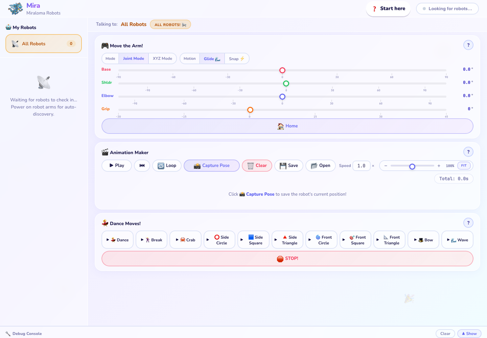
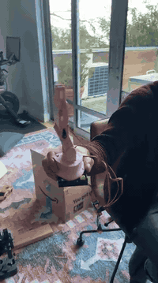

# 🦾 Mira robot arm: family guide

> Mira is the robot arm built by Miraloma students. This page is for parents and children who want to make it move, teach it a routine, and save their work. No programming experience is needed.

| Platform | App | Available connections |
|---|---|---|
| macOS | [](https://github.com/spedemon/miraloma_robotics/releases/latest/download/Mira-0.3.0-macOS-arm64.dmg) | Bluetooth, direct USB, wireless controller |
| Windows | [](https://github.com/spedemon/miraloma_robotics/releases/latest/download/Mira-Setup-0.3.0.exe) | Bluetooth, direct USB, wireless controller |
| Android | [](https://github.com/spedemon/miraloma_robotics/releases/latest/download/Mira-0.3.0-Android.apk) | Bluetooth |
| iPhone and iPad | [](#iphone-and-ipad) | Bluetooth; Apple signing not yet available |

[🆘 Jump to troubleshooting](#troubleshooting)



## Start here

Choose what you want to do:

| I want to… | What I need | Go to |
|---|---|---|
| Let the robot perform without a computer | Batteries **or** a USB-C phone charger | [Standalone mode](#use-mira-without-a-computer) |
| Control one robot from a tablet without a cable | Mira app, Android tablet, batteries | [Bluetooth mode](#connect-directly-by-bluetooth) |
| Control one robot from a computer | Mira app, laptop, USB-C data cable or Bluetooth | [Choose a connection](#2-choose-a-connection) |
| Control a robot without tethering it to the computer | Mira app, laptop, batteries, USB-C cable, ESP32-C3 Mini Pro | [Wireless mode](#connect-by-radio-wireless-mode) |
| Teach the robot a routine | A connected robot | [Make an animation](#make-an-animation-sequence) |
| Fix an arm that is not straight | A connected robot and, sometimes, a screwdriver | [Calibration](#calibrate-the-home-position) |

> **Adult supervision:** Keep fingers, hair, and loose clothing away from moving joints and the claw. Put the robot on a stable surface. Use the red **STOP!** button in Mira whenever something does not look right.

## Use Mira without a computer

Mira already knows several moves and can perform them without the application.

1. Power the robot in either of these ways:
   - insert its batteries, **or**
   - leave the batteries out and connect its USB-C port to a phone charger or USB battery pack.
2. Wait for the lights to turn on.
3. Find the tiny control board—the small board with the USB-C connector.
4. Press its small **BOOST** button once. Mira performs a built-in sequence.
5. Press **BOOST** again to return Home. Each later press alternates between Home and the next built-in sequence.

Home is Mira’s neutral pose: the arm points straight up and the claw is closed. Give the robot room to move before pressing the button.

## Use Mira with a computer

### 1. Install the Mira application

#### macOS

> **Important—the first launch may look blocked:** Mira is not yet notarized by
> Apple. macOS may say **“Apple could not verify ‘Mira’ is free of malware”**
> even when you right-click the app and choose **Open**. This does not mean the
> download is broken. Follow the steps below to approve it once; afterward it
> opens normally.

1. [Download Mira for macOS](https://github.com/spedemon/miraloma_robotics/releases/latest/download/Mira-0.3.0-macOS-arm64.dmg).
2. Open the downloaded `.dmg` file and drag **Mira** into **Applications**.
3. Try to open Mira from **Applications**. If the warning appears, click **Done**.
4. Immediately open **Apple menu → System Settings → Privacy & Security**.
5. Scroll down to **Security**, find the message saying Mira was blocked, and click **Open Anyway**.
6. Use your Mac password or Touch ID when asked, then click **Open**.

If **Open Anyway** is not visible, try opening Mira again and return to **Privacy & Security**. Apple makes the button available for about one hour after a blocked launch. This extra confirmation is needed because the current application is not Apple-notarized. See [Apple's illustrated instructions](https://support.apple.com/guide/mac-help/open-a-mac-app-from-an-unidentified-developer-mh40617/mac) if the controls look different on your version of macOS.

#### Windows computers

1. [Download Mira for Windows](https://github.com/spedemon/miraloma_robotics/releases/latest/download/Mira-Setup-0.3.0.exe).
2. Open the downloaded installer and follow its steps.
3. If Windows SmartScreen appears, choose **More info → Run anyway**.

The Windows launcher is built automatically on GitHub’s Windows runner, but it has not yet been tested with a physical robot on a Windows computer. Treat this first version as experimental and [report any problem](https://github.com/spedemon/miraloma_robotics/issues).

#### Android tablets

No developer account or app-store registration is required.

1. [Download Mira for Android](https://github.com/spedemon/miraloma_robotics/releases/latest/download/Mira-0.3.0-Android.apk) on the tablet.
2. Open the downloaded `.apk` file.
3. If Android blocks it, open the offered settings screen and allow **Install unknown apps** for the browser or file manager you used, then try again.
4. Tap **Install**, launch Mira, and allow **Nearby devices** when asked.

The APK is signed with Mira's own update certificate. Android displays the
normal warning for applications installed outside Google Play. Future versions
can install as updates because releases keep using that same certificate.

#### iPhone and iPad

The Mira iPhone/iPad application is ready for Apple signing and distribution,
but it cannot be offered as a normal downloadable installation yet. Apple
requires an active Apple Developer account to create the signed provisioning
profiles and distributable `.ipa`, and iOS does not install Android `.apk`
files. Once the account is available, the iOS build can be signed and added to
GitHub Releases or distributed through TestFlight. Until then, use the Android,
macOS, or Windows application.

### 2. Choose a connection

Mira has three connection methods. The desktop applications support all three;
the Android application uses direct Bluetooth.

#### Connect directly by Bluetooth

1. Install batteries in the robot and turn it on. Do not connect the robot to the computer or tablet by USB.
2. Launch Mira and allow Bluetooth access. On Android this permission is called **Nearby devices**.
3. Tap the connection badge at the top. A nearby robot appears under **Bluetooth**.
4. Tap **Connect** next to that robot. The badge changes to the robot's name when it is ready.

The application communicates directly with one or more robots using Bluetooth Low
Energy. It does not need Wi-Fi, a USB cable, or the separate wireless
controller. Each connection is deliberate rather than automatic, so a nearby
classmate's device cannot silently take control. Bluetooth is available on
Android, macOS, and Windows.

#### Connect with a USB cable

1. **Remove the robot’s batteries.** Do not use battery power and computer USB power at the same time.
2. Connect a USB-C **data** cable from the laptop to the USB-C port on the robot’s small control board.
3. Launch **Mira**.
4. Wait until the connection badge at the top stops saying **Looking for robots…** and shows the connected robot.

The laptop powers the robot through the USB cable in this mode.

#### Connect by radio (wireless mode)

You need one [ESP32-C3 Mini Pro development board](https://www.amazon.com/Development-Microcontroller-Interfaces-Unassembled-Compatible/dp/B0GVSJFRTN/). This small board becomes the radio remote for the laptop.

1. Insert the batteries in the robot.
2. Check its lights: the motor board should show a red light, and the small control board should show a slowly blinking blue light.
3. Connect the ESP32-C3 Mini Pro remote board to the laptop with a USB-C **data** cable.
4. Launch **Mira**.
5. If Mira says the board is new, choose **Wireless controller** and let Mira set it up. Keep the cable connected until it says the update is complete.
6. Wait a few seconds for the robot to appear in **My Robots**.

The robot and remote board communicate directly by radio; they do not need Wi-Fi or pairing. The same remote can discover more than one powered robot.

The **Start here** button inside Mira explains the same three connection methods.

<div align="center">

[](../media/miraloma_robots_demo.mp4)

*Mira robot arms performing together—click to watch the full video.*

</div>

## Your first moves in Mira

1. Choose one robot under **My Robots**. Choose **All Robots** only when you intentionally want every connected robot to move together.
2. Click **Home**. Mira should stand straight up with its claw closed.
3. In **Joint Mode**, move one slider slowly to learn what it controls:
   - **Base** turns left and right.
   - **Shoulder** moves the lower arm.
   - **Elbow** bends the upper arm.
   - **Grip** opens and closes the claw.
4. Use **Glide** for smooth movement. **Snap** moves directly and is best saved for experienced users.
5. Try a button under **Dance Moves!**. Click the active move again—or click **STOP!**—to stop it.

**XYZ Mode** moves the claw through space instead of moving one joint at a time. It is useful after Joint Mode feels familiar. Its Top, Side, and Front views shade the positions the arm can reach for the current third coordinate. Click or drag anywhere in a view to move immediately; if the clicked point is unreachable, the robot moves to the nearest reachable point in that 2D plane. You can also enter X/Y/Z values and click **Move robot**. An unreachable value entered manually stays visible in red, the app explains which reach or joint limit blocks it, and the robot remains at its previous safe position. The 3D overview draws the arm’s estimated pose using the same speed and acceleration limits as firmware; because the app does not receive live joint telemetry, this is an estimate rather than a measurement.

## Make an animation sequence

A sequence is a list of poses. Mira glides from one saved pose to the next, making a dance, wave, pick-up motion, or story.

1. Move the robot to the first pose with the sliders.
2. Click **📸 Capture Pose**.
3. Move to the next pose and click **Capture Pose** again.
4. Repeat until the routine is complete.
5. Click **▶ Play** to preview it. Click Play again to pause, and **⏮** to return to the beginning.
6. Drag a pose on the timeline to change when it happens. Drag its edge to change how long the move takes. Use **Speed** to preview the whole routine faster or slower.

### Save, open, loop, and upload

| Control | What it means |
|---|---|
| **Save** | Downloads the sequence as a file on this computer. Use this for a backup or to share the routine. |
| **Open** | Loads a sequence file from the computer into the Animation Maker. It replaces the sequence currently on the timeline. |
| **Loop** | When highlighted, Play starts again after the last pose and repeats until paused or stopped. When off, the sequence plays once. |
| **Upload to Robot** | Stores the sequence on the selected robot so it appears with the robot’s custom moves. This is different from Save: Save keeps a file on the computer; Upload keeps the move on the robot. |
| **Clear** | Removes every pose from the current timeline after confirmation. Save first if you may want the sequence later. |

Mira also restores the most recent timeline automatically on the same computer, but **Save** is still the safest way to keep or share a routine.

## Calibrate the Home position

### Why calibration is needed

Small servo motors and hand-built parts are never perfectly identical. When the software asks two servos for the same angle, their real positions can differ by a few degrees. Calibration records a small correction for each joint so Mira’s software Home matches the robot’s real, straight Home pose.

### How to calibrate

1. Select **one robot** under **My Robots**. The **Calibrate** button appears only for one robot at a time.
2. Click **Home**, then **Calibrate**. The robot may move; keep hands clear.
3. Adjust one calibration slider at a time until:
   - the base faces forward,
   - the arm sections form a straight vertical line, and
   - the claw is closed without straining.
4. Click **Apply Calibration**. The correction is stored on that robot.
5. Click **Home** again to check the result.

Use the smallest correction that makes the joint straight. **Reset to Zero** removes all software corrections; **Cancel** leaves the saved calibration unchanged.

### If calibration cannot make the robot straight or preserve full motion

If calibration cannot make the arm stand straight with its claw closed, a joint cannot move through its full range, or the claw cannot open, the servo horn (the white nylon arm attached to the servo shaft) was probably installed at the wrong angle. Software calibration is only for small differences; it cannot correct a large assembly offset.

1. Click **Home** and leave the robot powered so the servo holds the correct electronic Home angle.
2. Identify only the crooked joint. Take a photo first so you can remember how its parts fit.
3. While supporting the robot part so it cannot fall or twist, remove the screw in the center of that servo horn.
4. Gently lift the horn off the toothed servo shaft. **Do not turn the servo shaft.**
5. Place the robot section in its correct Home position by hand: straighten an arm joint, or gently place the claw closed without straining it.
6. Refit the horn onto the shaft in the tooth position that best preserves that straight pose, then replace the screw.
7. Click **Home** again, verify that the joint can use its full range (including opening the claw), and use software calibration only for the small remaining difference.

An adult should do this repair. Disconnect power before moving wires or doing any work beyond repositioning the servo horn.

## Troubleshooting

| What you see | What to check |
|---|---|
| Mira keeps saying **Looking for robots…** | For Bluetooth, check that the robot has firmware 0.6.0 or newer, is powered, and that Mira has Nearby devices/Bluetooth permission. For USB, use a USB-C **data** cable and try another port. Click the connection badge for details. |
| Robot is dark in wireless mode | Check battery direction and charge. The motor board should have a red LED. |
| Red LED is on, but the robot never appears wirelessly | Confirm the control board’s blue LED blinks slowly and that the ESP32-C3 Mini Pro remote is connected to the laptop. Keep the robot near the laptop while testing. |
| Robot moves unexpectedly | Click **STOP!**, move hands away, then click **Home**. Select one robot instead of **All Robots** before experimenting. |
| Home is a little crooked | Follow [Calibrate the Home position](#calibrate-the-home-position). |
| Home is far off and calibration reaches its limit | Follow [If calibration cannot make an axis straight](#if-calibration-cannot-make-an-axis-straight). |
| A saved file is missing | **Save** downloads through the computer; check the Downloads folder. Uploaded robot moves are listed under custom gestures instead. |

## For contributors and builders

Everything below is for people changing the hardware, firmware, or application. Families using a completed arm can stop here.

### Project layout

```text
robot_arms/
├── 3d_models/       # CAD, STL, and 3D-print projects
├── robotarm_mcu/    # Firmware used by every robot arm
├── master_mcu/      # Firmware for the USB/radio controller
├── web_app/         # Shared interface and Mira desktop application
└── android_app/     # Native Android BLE wrapper around the shared interface
```

Mira v1 is the four-axis classroom arm built by Miraloma students. Mira v2 uses five axes, fewer fasteners, and a modular base. See the [3D printing guide](3d_models/README.md) for models and part details.

### How the connection works

- **Direct USB:** The application sends commands straight to one robot’s serial connection.
- **Direct Bluetooth:** Android, macOS, or Windows connects to a robot's BLE service and uses the same command protocol without a cable.
- **Wireless:** A USB-connected ESP32-C3 runs `master_mcu` and bridges application commands to the robots over ESP-NOW.
- **Discovery and names:** Every robot announces its factory MAC address and saved display name. Renaming in Mira stores the name in robot flash, so it follows the robot across USB, Bluetooth, and wireless-controller connections without manual pairing or Wi-Fi.
- **Multiple robots:** Commands can target one MAC address or broadcast to every discovered robot.

### Run from source

Requirements: Python 3.10+ and PlatformIO for firmware work.

```bash
cd robot_arms/web_app
python3 -m pip install -r requirements.txt
python3 mira.py
```

Open `http://localhost:5050`. For firmware build and flash instructions, see [robot firmware](robotarm_mcu/README.md), [`robotarm_mcu/`](robotarm_mcu/), and [`master_mcu/`](master_mcu/).

### Build desktop launchers

```bash
# macOS
cd robot_arms/web_app
./scripts/build_macos.sh
```

```powershell
# Windows PowerShell on a Windows computer
cd robot_arms\web_app
.\scripts\build_windows.ps1
```

The [Build Mira workflow](../.github/workflows/build-desktop.yml) builds firmware, both desktop packages, and the signed Android APK. Android has a repeatable signed build described in [the Android README](android_app/README.md). Tagged builds publish artifacts to GitHub Releases. Each desktop build now runs a packaged-runtime check before creating its installer, including a Bluetooth import check. Desktop launchers are currently unsigned, so operating systems may show the security prompts described above.

### Firmware and application development

Configuration lives in:

- [`robotarm_mcu/include/config.h`](robotarm_mcu/include/config.h) for servo channels, limits, and arm geometry
- [`master_mcu/include/config.h`](master_mcu/include/config.h) for wireless and heartbeat behavior
- [`web_app/mira.py`](web_app/mira.py) for the application server

Please test application changes with direct USB, Bluetooth, and the wireless controller when hardware is available. General contribution guidance is in the [repository README](../README.md#for-contributors).
