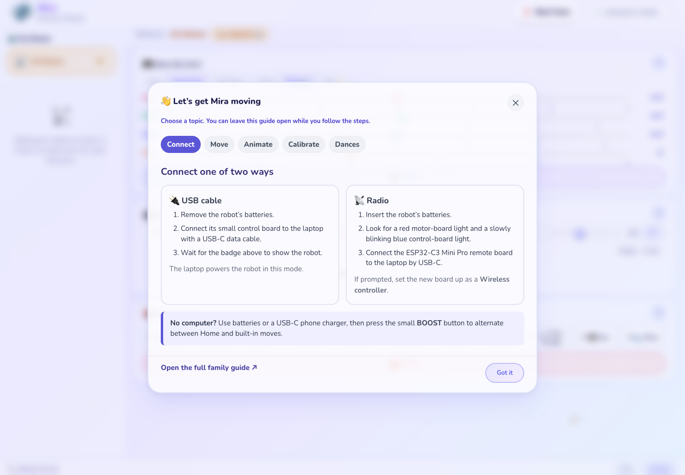

# 🦾 Mira robot arm: family guide

> Mira is the robot arm built by Miraloma students. This page is for parents and children who want to make it move, teach it a routine, and save their work. No programming experience is needed.

[⬇️ Download Mira for macOS](https://github.com/spedemon/miraloma_robotics/releases/latest) · [⬇️ Download Mira for Windows](https://github.com/spedemon/miraloma_robotics/releases/latest) · [🆘 Jump to troubleshooting](#troubleshooting)


## Start here

Choose what you want to do:

| I want to… | What I need | Go to |
|---|---|---|
| Let the robot perform without a computer | Batteries **or** a USB-C phone charger | [Standalone mode](#use-mira-without-a-computer) |
| Control one robot from a computer | Mira app, laptop, USB-C data cable | [USB cable mode](#connect-with-a-usb-cable) |
| Control a robot without tethering it to the computer | Mira app, laptop, batteries, USB-C cable, ESP32-C3 Mini Pro | [Wireless mode](#connect-by-radio-wireless-mode) |
| Teach the robot a routine | A connected robot | [Make an animation](#make-an-animation-sequence) |
| Fix an arm that is not straight | A connected robot and, sometimes, a screwdriver | [Calibration](#calibrate-the-home-position) |

> **Adult supervision:** Keep fingers, hair, and loose clothing away from moving joints and the claw. Put the robot on a stable surface. Use the red **STOP!** button in Mira whenever something does not look right.

## Use Mira without a computer

Mira already knows several moves and can perform them without the application.

1. Power the robot in either of these ways:
   - insert its batteries, **or**
   - leave the batteries out and connect its USB-C port to a phone charger or USB battery pack.
2. Wait for the lights to turn on.
3. Find the tiny control board—the small board with the USB-C connector.
4. Press its small **BOOST** button once. Mira performs a built-in sequence.
5. Press **BOOST** again to return Home. Each later press alternates between Home and the next built-in sequence.

Home is Mira’s neutral pose: the arm points straight up and the claw is closed. Give the robot room to move before pressing the button.

## Use Mira with a computer

### 1. Install the Mira application

#### macOS

1. Open the [latest Mira release](https://github.com/spedemon/miraloma_robotics/releases/latest).
2. Under **Assets**, download the file whose name ends in `.dmg` and includes `macOS`.
3. Open the downloaded disk image and drag **Mira** into **Applications**.
4. Open Mira. If macOS blocks the first launch, open **System Settings → Privacy & Security**, find the Mira message, and choose **Open Anyway**.

The application is unsigned, which is why macOS asks for this extra confirmation.

#### Windows computers

1. Open the [latest Mira release](https://github.com/spedemon/miraloma_robotics/releases/latest).
2. Under **Assets**, download the file whose name starts with `Mira-Setup-` and ends in `.exe`.
3. Open the installer and follow its steps.
4. If Windows SmartScreen appears, choose **More info → Run anyway**.

The Windows launcher is built automatically on GitHub’s Windows runner, but it has not yet been tested with a physical robot on a Windows computer. Treat this first version as experimental and [report any problem](https://github.com/spedemon/miraloma_robotics/issues).

### 2. Choose a connection

Mira works the same way in the application after it is connected. The only difference is whether the laptop talks directly through a cable or through a small radio board.

#### Connect with a USB cable

1. **Remove the robot’s batteries.** Do not use battery power and computer USB power at the same time.
2. Connect a USB-C **data** cable from the laptop to the USB-C port on the robot’s small control board.
3. Launch **Mira**.
4. Wait until the connection badge at the top stops saying **Looking for robots…** and shows the connected robot.

The laptop powers the robot through the USB cable in this mode.

#### Connect by radio (wireless mode)

You need one [ESP32-C3 Mini Pro development board](https://www.amazon.com/Development-Microcontroller-Interfaces-Unassembled-Compatible/dp/B0GVSJFRTN/). This small board becomes the radio remote for the laptop.

1. Insert the batteries in the robot.
2. Check its lights: the motor board should show a red light, and the small control board should show a slowly blinking blue light.
3. Connect the ESP32-C3 Mini Pro remote board to the laptop with a USB-C **data** cable.
4. Launch **Mira**.
5. If Mira says the board is new, choose **Wireless controller** and let Mira set it up. Keep the cable connected until it says the update is complete.
6. Wait a few seconds for the robot to appear in **My Robots**.

The robot and remote board communicate directly by radio; they do not need Wi-Fi or pairing. The same remote can discover more than one powered robot.



*The **Start here** button opens the same connection instructions inside the application.*

## Your first moves in Mira

1. Choose one robot under **My Robots**. Choose **All Robots** only when you intentionally want every connected robot to move together.
2. Click **Home**. Mira should stand straight up with its claw closed.
3. In **Joint Mode**, move one slider slowly to learn what it controls:
   - **Base** turns left and right.
   - **Shoulder** moves the lower arm.
   - **Elbow** bends the upper arm.
   - **Grip** opens and closes the claw.
4. Use **Glide** for smooth movement. **Snap** moves directly and is best saved for experienced users.
5. Try a button under **Dance Moves!**. Click the active move again—or click **STOP!**—to stop it.

**XYZ Mode** moves the claw through space instead of moving one joint at a time. It is useful after Joint Mode feels familiar. Some X/Y/Z combinations are physically out of reach; if the robot does not move, bring the sliders closer to their previous values.

## Make an animation sequence

A sequence is a list of poses. Mira glides from one saved pose to the next, making a dance, wave, pick-up motion, or story.

1. Move the robot to the first pose with the sliders.
2. Click **📸 Capture Pose**.
3. Move to the next pose and click **Capture Pose** again.
4. Repeat until the routine is complete.
5. Click **▶ Play** to preview it. Click Play again to pause, and **⏮** to return to the beginning.
6. Drag a pose on the timeline to change when it happens. Drag its edge to change how long the move takes. Use **Speed** to preview the whole routine faster or slower.

### Save, open, loop, and upload

| Control | What it means |
|---|---|
| **Save** | Downloads the sequence as a file on this computer. Use this for a backup or to share the routine. |
| **Open** | Loads a sequence file from the computer into the Animation Maker. It replaces the sequence currently on the timeline. |
| **Loop** | When highlighted, Play starts again after the last pose and repeats until paused or stopped. When off, the sequence plays once. |
| **Upload to Robot** | Stores the sequence on the selected robot so it appears with the robot’s custom moves. This is different from Save: Save keeps a file on the computer; Upload keeps the move on the robot. |
| **Clear** | Removes every pose from the current timeline after confirmation. Save first if you may want the sequence later. |

Mira also restores the most recent timeline automatically on the same computer, but **Save** is still the safest way to keep or share a routine.

## Calibrate the Home position

### Why calibration is needed

Small servo motors and hand-built parts are never perfectly identical. When the software asks two servos for the same angle, their real positions can differ by a few degrees. Calibration records a small correction for each joint so Mira’s software Home matches the robot’s real, straight Home pose.

### How to calibrate

1. Select **one robot** under **My Robots**. The **Calibrate** button appears only for one robot at a time.
2. Click **Home**, then **Calibrate**. The robot may move; keep hands clear.
3. Adjust one calibration slider at a time until:
   - the base faces forward,
   - the arm sections form a straight vertical line, and
   - the claw is closed without straining.
4. Click **Apply Calibration**. The correction is stored on that robot.
5. Click **Home** again to check the result.

Use the smallest correction that makes the joint straight. **Reset to Zero** removes all software corrections; **Cancel** leaves the saved calibration unchanged.

### If calibration cannot make an axis straight

If a calibration slider reaches its limit and the joint is still visibly crooked, the servo horn (the small plastic arm attached to the servo shaft) was probably installed one tooth away from the correct position. Software calibration is only for small differences; it cannot correct a large assembly offset.

1. Click **Home** and leave the robot powered so the servo holds the correct electronic Home angle.
2. Identify only the crooked joint. Take a photo first so you can remember how its parts fit.
3. While supporting the robot part so it cannot fall or twist, remove the screw in the center of that servo horn.
4. Gently lift the horn off the toothed servo shaft. **Do not turn the servo shaft.**
5. Place the robot arm section in the correct straight Home position by hand.
6. Refit the horn onto the shaft in the tooth position that best preserves that straight pose, then replace the screw.
7. Click **Home** again and use software calibration only for the small remaining difference.

An adult should do this repair. Disconnect power before moving wires or doing any work beyond repositioning the servo horn.

## Troubleshooting

| What you see | What to check |
|---|---|
| Mira keeps saying **Looking for robots…** | Use a USB-C **data** cable; some charging cables carry power only. Try another USB port, reconnect the cable, and click the connection badge for device details. |
| Robot is dark in wireless mode | Check battery direction and charge. The motor board should have a red LED. |
| Red LED is on, but the robot never appears wirelessly | Confirm the control board’s blue LED blinks slowly and that the ESP32-C3 Mini Pro remote is connected to the laptop. Keep the robot near the laptop while testing. |
| Robot moves unexpectedly | Click **STOP!**, move hands away, then click **Home**. Select one robot instead of **All Robots** before experimenting. |
| Home is a little crooked | Follow [Calibrate the Home position](#calibrate-the-home-position). |
| Home is far off and calibration reaches its limit | Follow [If calibration cannot make an axis straight](#if-calibration-cannot-make-an-axis-straight). |
| A saved file is missing | **Save** downloads through the computer; check the Downloads folder. Uploaded robot moves are listed under custom gestures instead. |

## For contributors and builders

Everything below is for people changing the hardware, firmware, or application. Families using a completed arm can stop here.

### Project layout

```text
robot_arms/
├── 3d_models/       # CAD, STL, and 3D-print projects
├── robotarm_mcu/    # Firmware used by every robot arm
├── master_mcu/      # Firmware for the USB/radio controller
└── web_app/         # Mira desktop application and browser UI
```

Mira v1 is the four-axis classroom arm built by Miraloma students. Mira v2 uses five axes, fewer fasteners, and a modular base. See the [3D printing guide](3d_models/README.md) for models and part details.

### How the connection works

- **Direct USB:** The application sends commands straight to one robot’s serial connection.
- **Wireless:** A USB-connected ESP32-C3 runs `master_mcu` and bridges application commands to the robots over ESP-NOW.
- **Discovery:** Every robot runs the same firmware and announces its factory MAC address. The controller assigns display names and routes commands without manual pairing or a Wi-Fi network.
- **Multiple robots:** Commands can target one MAC address or broadcast to every discovered robot.

### Run from source

Requirements: Python 3.10+ and PlatformIO for firmware work.

```bash
cd robot_arms/web_app
python3 -m pip install -r requirements.txt
python3 mira.py
```

Open `http://localhost:5050`. For firmware build and flash instructions, see [robot firmware](robotarm_mcu/README.md), [`robotarm_mcu/`](robotarm_mcu/), and [`master_mcu/`](master_mcu/).

### Build desktop launchers

```bash
# macOS
cd robot_arms/web_app
./scripts/build_macos.sh
```

```powershell
# Windows PowerShell on a Windows computer
cd robot_arms\web_app
.\scripts\build_windows.ps1
```

The [Build Mira Desktop workflow](../.github/workflows/build-desktop.yml) builds firmware and both desktop packages. Tagged builds publish artifacts to GitHub Releases. Launchers are currently unsigned, so operating systems may show the security prompts described above.

### Firmware and application development

Configuration lives in:

- [`robotarm_mcu/include/config.h`](robotarm_mcu/include/config.h) for servo channels, limits, and arm geometry
- [`master_mcu/include/config.h`](master_mcu/include/config.h) for wireless and heartbeat behavior
- [`web_app/mira.py`](web_app/mira.py) for the application server

Please test application changes in both direct USB and wireless modes when hardware is available. General contribution guidance is in the [repository README](../README.md#for-contributors).
